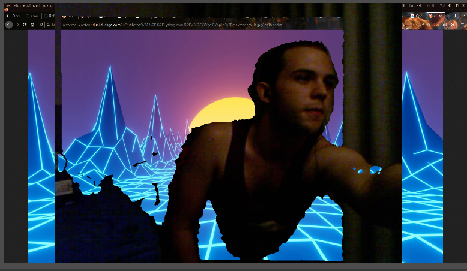

# cronect

Using Kinect v1 camera as a chromakey or webcam.

That's it: no need for a messy green screen behind you to record videos!

## Usage:

- Install [libfreenect](https://github.com/OpenKinect/libfreenect), which are the drivers needed for interfacing with the Kinect (we also need the "c\_sync" wrapper, but this one is included in the project).
- Install [openCV](https://opencv.org/), so we can do image processing.
- Run `make setup-devices`, which configures a virtual camera, using v4l2-loopback (video4linux2).
- Run `make && make run`

*Important: you need to add your user to ***some*** group, otherwise you'll need to run the executable as _sudo_*

## Current Issues:

- Only Chromium based browsers detect the loopback camera because of a [bug in
  v4l2loopack](https://stackoverflow.com/questions/64751478/v4l2loopback-device-detected-by-chrome-not-seen-by-zoom-or-firefox).
- Perspective is wrong, so there's a significant offset in the captured image and the depth values.
- Some noise appears on the image.

## Results:

## Thanks:

- Thanks to [Oscar Aceña](https://bitbucket.org/OscarAcena/) for his work on [ocv-virtual-cam](https://bitbucket.org/OscarAcena/ocv-virtual-cam), on which this project has a large basis.
- Thanks to the [ROS](https://www.ros.org) community for providing [this article](http://wiki.ros.org/kinect_calibration/technical).
